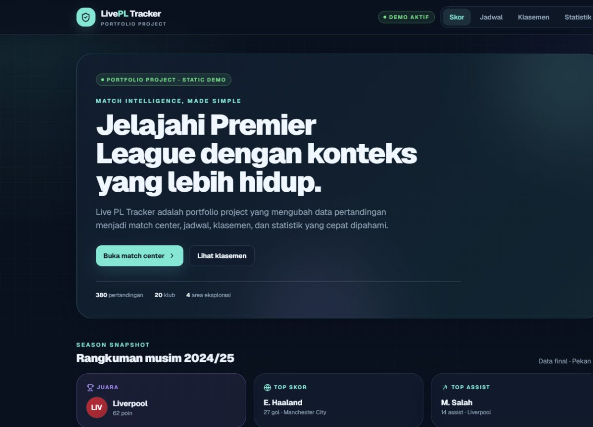
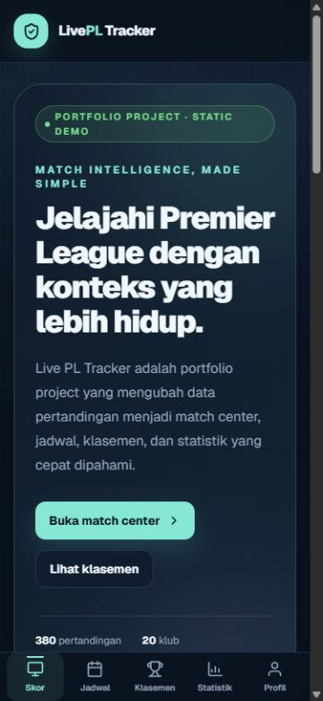
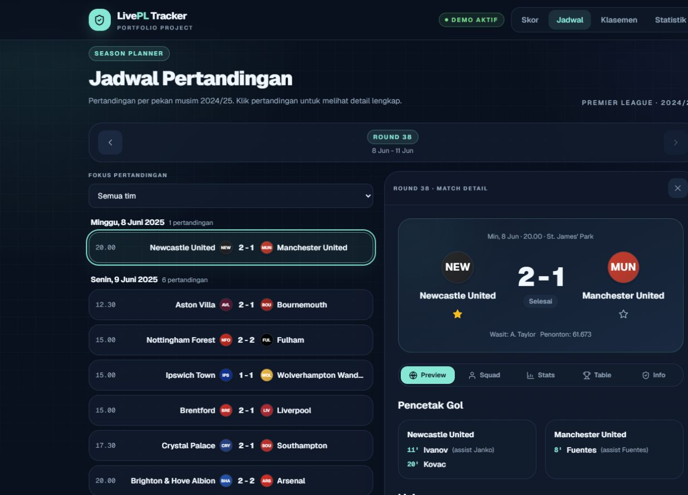

# Live PL Tracker

> Portfolio case study — dashboard Premier League yang mengubah data skor,
> jadwal, klasemen, dan statistik menjadi pengalaman match center yang cepat
> dipahami.

[Live demo](https://live-pl-tracker.pages.dev) · [Product requirements](./docs/PRD.md) · [Design system](./docs/DESIGN.md)

## Ringkasan Portfolio

Live PL Tracker dibuat sebagai bukti end-to-end product engineering: mulai dari
memodelkan data olahraga, merancang user flow mobile-first, membangun interface
responsif, mengamankan boundary API, sampai menghasilkan static artifact yang
siap di-deploy ke Cloudflare Pages.

Demo deploy memakai data mock deterministik musim final 2024/25. Dengan begitu,
recruiter dapat membuka seluruh flow tanpa API key, login, atau ketergantungan
pada rate limit provider eksternal.

## Problem

Informasi sepak bola sering tersebar di banyak halaman dan sulit dipindai cepat
di mobile. Di sisi portfolio, project berbasis API juga mudah gagal direview
ketika API key tidak tersedia, rate limit habis, atau data live tidak konsisten.

Project ini menjawab dua masalah tersebut dengan satu static experience yang:

- merangkum konteks penting di Home;
- menyediakan detail bertahap melalui Match Center;
- menjaga data deploy tetap deterministik dan aman;
- tetap menunjukkan adapter API yang dapat dikembangkan ke live mode.

## User

| Persona | Kebutuhan |
|---|---|
| **The Reviewer** — recruiter, hiring manager, tech lead | Memahami kualitas UX, arsitektur, dan trade-off teknis dalam waktu singkat |
| **The Football Fan** — suporter mobile-first | Mengecek hasil, jadwal, klasemen, statistik, dan tim favorit tanpa login |
| **The Casual Visitor** | Mendapat konteks project dari landing page yang menarik |

## Solution

Sebuah dashboard editorial sports-tech dengan empat area utama:

1. **Scores / Home** — hero portfolio, season snapshot, hasil pertandingan, dan
   top 5 klasemen.
2. **Schedule** — round 1–38, grouping per tanggal, filter tim, dan master-detail
   match center.
3. **Standings & Stats** — klasemen 20 klub, top scorers, dan top assists.
4. **Team & Profile** — profil klub, form guide, fixture terkait, serta favorit
   berbasis `localStorage`.

## Key Features

- Match Center dengan scoreboard, goal scorers, timeline, match stats, lineup,
  tabel, dan info venue.
- Schedule browser dengan round switcher, team filter, dan detail sticky pada
  desktop.
- Responsive standings table dengan zona UCL dan highlight tim favorit.
- Top scorers dan top assists.
- Team profile dengan ranking, poin, form, dan fixture terkait.
- Guest favorites tanpa akun; data hanya tersimpan di perangkat pengguna.
- SEO metadata per halaman, canonical, Open Graph/Twitter, robots, dan sitemap.
- Loading skeleton, not-found state, focus-visible state, dan reduced-motion support.

## Screenshots

### Desktop — Home



### Mobile — Home



### Desktop — Schedule & Match Center



## Challenge

### Static export vs live sports data

Static export tidak dapat melakukan polling server-side. Build deploy karena itu
menggunakan mock provider deterministik, sedangkan adapter API-Football tetap
tersedia untuk eksperimen server-side lokal dan roadmap live polling.

### Data density vs readability

Match card dan tabel harus kaya informasi tanpa menjadi padat. Solusinya adalah
progressive disclosure: ringkasan pada Home, detail dalam tab Match Center,
short team names di mobile, dan scroll container untuk kolom tambahan.

### API security vs demo reliability

API key tidak dibawa ke client bundle. Build resmi mengosongkan key dan membake
JSON mock ke `public/data/`, sehingga demo tetap dapat direview tanpa secret atau
kuota provider.

### Motion vs performance

Motion hanya digunakan untuk reveal berbasis viewport dengan `opacity` dan
`transform`. Hover/press feedback memakai CSS dan pengguna dengan reduced-motion
tidak menerima transform besar.

## Impact

Angka berikut adalah evidence teknis dari build, bukan klaim analytics produksi:

- **410** static pages berhasil diprerender.
- **380** halaman detail pertandingan.
- **20** halaman profil klub.
- **0** API key dikirim ke browser pada deploy artifact.
- Responsive smoke test 375px lulus tanpa horizontal overflow.
- Lint, TypeScript, static build, dan artifact verification digunakan sebagai
  quality gate.

## Tech Choices

| Layer | Teknologi | Alasan |
|---|---|---|
| Frontend | Next.js 16 App Router + TypeScript | Static generation, routing, metadata API, dan type safety |
| Styling | Tailwind CSS v4 | Token dan responsive utility tanpa CSS-in-JS runtime |
| UI | shadcn/ui-inspired primitives | Open composition; hanya komponen yang diperlukan |
| Motion | Motion (`motion/react`) | Viewport reveal dan reduced-motion support |
| Data | Mock provider + API-Football adapter | Deterministic deploy sekaligus extensible ke live provider |
| Persistence | `localStorage` | Guest-first personalization tanpa backend MVP |
| Deploy | Static export + Cloudflare Pages | CDN-friendly, cepat, dan rendah biaya |

## Design

Arah visual lengkap dibahas di [docs/DESIGN.md](./docs/DESIGN.md):

- editorial sports-tech dengan dark navy dan cyan accent;
- surface bertingkat, ambient gradient non-repeating, dan hierarchy tipografi;
- one-thumb mobile navigation;
- semantic tabs, focus ring, touch target 44px, dan reduced motion.

## Architecture

```text
[Next.js Server Components saat build]
              │
              ├── Mock provider deterministik
              │       └── public/data/*.json
              │
              └── Static export
                       └── out/ → Cloudflare Pages

[Client islands]
  Header · BottomNav · ScheduleBrowser · Favorites · Motion Reveal
```

Provider API-Football hanya digunakan server-side lokal. Tidak ada route handler
runtime pada artifact static.

## Struktur Project

```text
src/
├── app/                    # routes, metadata, robots, sitemap
├── components/
│   ├── ui/                 # Badge, Button, Card, Reveal, icons, TeamCrest
│   ├── match/              # Match Center panels
│   └── schedule/           # Schedule master-detail components
├── lib/                    # API facade, provider, formatting, favorites
└── types/                  # domain models
docs/
├── PRD.md                  # problem, scope, architecture, roadmap
├── DESIGN.md               # visual system dan accessibility rules
└── screenshots/            # screenshot portfolio
scripts/
├── bake-data.mts           # bake mock/API data ke public/data
├── build-static.mjs        # build deterministic static artifact
└── verify-static.mjs       # route dan artifact verification
```

## Menjalankan Lokal

```bash
cp .env.example .env
npm install
npm run dev
```

Quality gates:

```bash
npm run lint
npm run build
npm run verify:static
npm run preview
```

`npm run build` membake mock data lalu membuat static export ke `out/`.
`npm run preview` menjalankan artifact tersebut melalui Wrangler Pages.

## Data & Security

- Deploy default menggunakan `src/lib/api/mock.ts` dan data JSON deterministik.
- `API_FOOTBALL_KEY` tidak pernah diekspor ke client.
- `NEXT_PUBLIC_SITE_URL` mengatur canonical, robots, sitemap, dan metadata base.
- Jika provider error atau rate limit, facade melakukan fallback ke mock provider.

## Roadmap

- Live polling conditional 30–60 detik untuk pertandingan LIVE.
- API route sebagai server proxy dengan cache dan rate-limit budget.
- Auth + database untuk favorit lintas perangkat.
- OG image khusus dan automated browser regression.

Detail status implemented vs roadmap tersedia di [docs/PRD.md](./docs/PRD.md).
